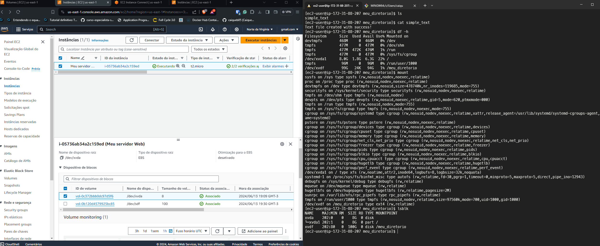
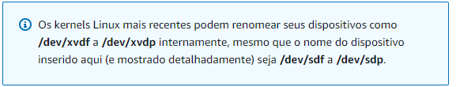

Exercício EC2 com adição de Volume

Passos:

1- Criação da Instância EC2 utilizando a imagem Amazon Linux 2 AMI 
2- Conexão via ssh: ssh -i /path/da/chave {nome-da-maquina}@{ip-da-maquina} 
3- Criação de um novo volume EBS e associação à instância; 
4- Para listar o volume: $ lsblk 
5- Para formatar: $ sudo mkfs -t ext4 /dev/xvdf 
6- Para montar o volume: $ sudo mount /dev/xvdf /meu_diretorio 

 

Com relação ao nome do volume, surge esse aviso quando você cria ele: 

